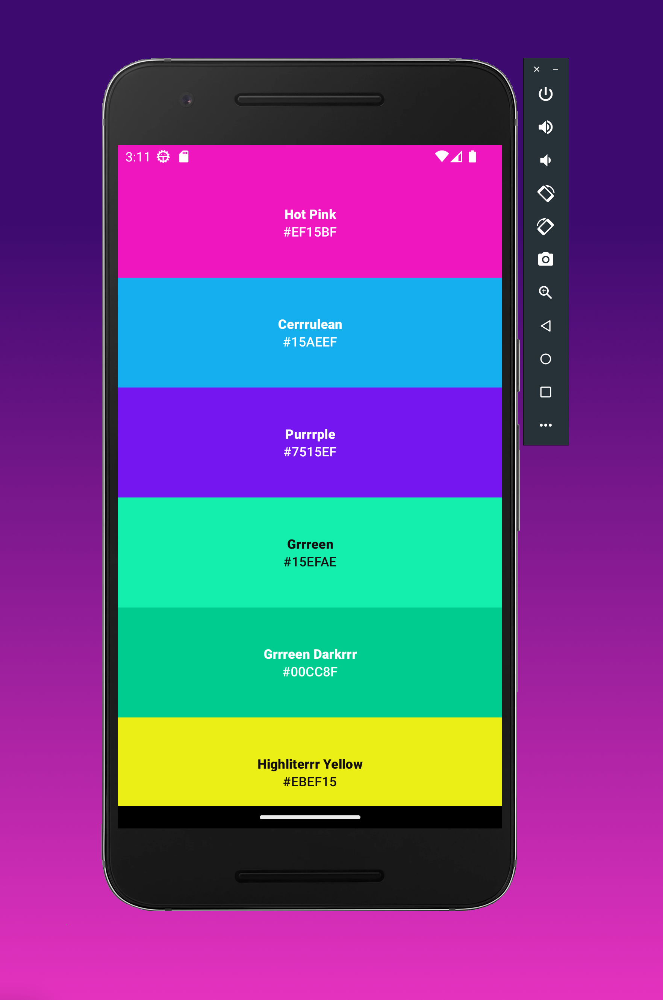
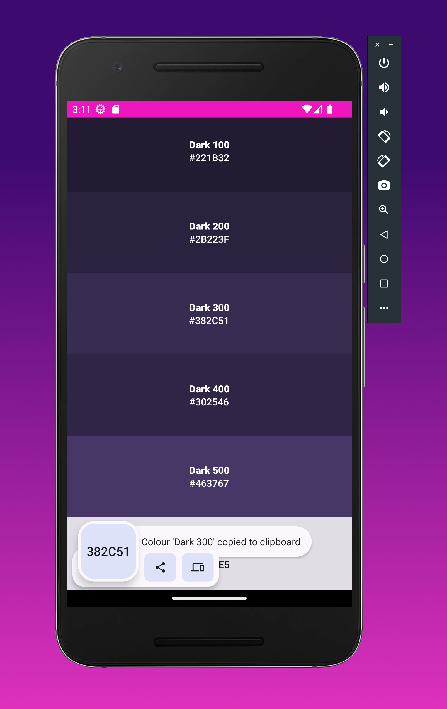
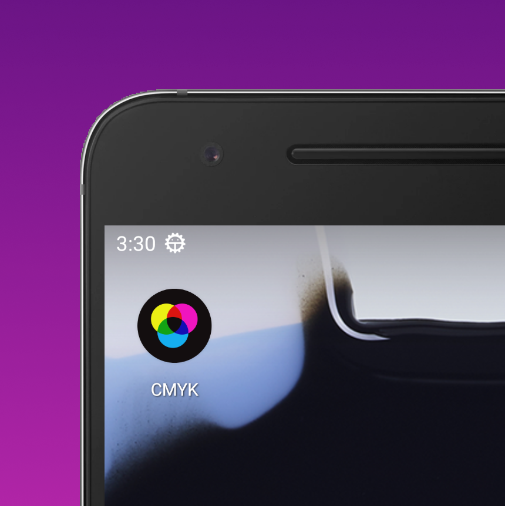

<h1 align="center">CMYK colourrrs</h1>

  

  <strong>CMYK colourrrs</strong> is a dark <a href="https://blog.techygrrrl.stream/cmyk">colour theme</a> for your text editor, IDE, and terminal.

  by <a href="https://techygrrrl.stream">techygrrrl</a>

- [CMYK Colourrrs for Android](#cmyk-colourrrs-for-android)
  - [Features](#features)
  - [Development](#development)
  - [Install on your Android device](#install-on-your-android-device)
    - [Using Android Studio](#using-android-studio)
    - [Using the Command Line](#using-the-command-line)

## CMYK Colourrrs for Android

This is an Android app that has the CMYK Colourrrs colour palette.

### Features

- 🌈 See all of the colours at a glance
- 📋 Tap on a colour to copy its hex code to your clipboard

### Development

Uses Android Studio Giraffe (stable).

### Install on your Android device

#### Using Android Studio

Install and run on your device in Android Studio.

#### Using the Command Line

Alternatively, build and install via the command line. Requires having the [Android command line tools](https://developer.android.com/tools) and SDKs installed.

Build a release APK:

    ./gradlew assembleDebug

Install the APK to your device:

    adb install -r app/build/outputs/apk/debug/app-debug.apk
